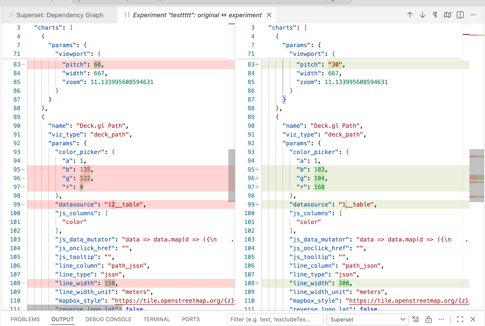

# Changelog

All notable changes to this extension are documented here.
The format follows [Keep a Changelog](https://keepachangelog.com/).

## [0.0.2] - Unreleased

### Added

- **Experiment on a dashboard** — a top-down, selective experiment. Pick a
  dashboard, choose which charts to experiment (unselected charts stay shared
  with the original), and optionally experiment their virtual datasets too
  (physical datasets are left shared — they can't be updated safely). Only the
  chosen objects are cloned and `[label]`-prefixed; everything else is shared.
- **Show Diff** on each experiment — compares the experiment against its source
  (dashboards, charts, and the datasets under those charts) in VS Code's native
  diff editor. Keys are sorted and volatile fields (`slice_id`, `viz_type`) are
  stripped so genuine edits stand out. Two modes:
  - **Full diff** — every field, including defaults Superset injects on save.
  - **Changes only** — shared fields only, so injected defaults drop out and you
    see pure value changes.

  

- **Lineage graph deletion** — filter to isolated (orphan) nodes, multi-select
  with ⌘/Ctrl-click, and delete. Deleting a dashboard offers to also remove any
  chart used only by that dashboard. Safe order: dashboards → charts → datasets.
- **Per-view refresh buttons** on the Connections, Saved Queries, and Dashboards
  views (Experiments already had one).

### Fixed

- **Experiment dashboards no longer depend on the original experimented charts.**
  Chart associations are now set from the chart side (the only reliable REST
  path) instead of relying on `position_json`, which the API never reconciles
  against a dashboard's chart membership. Previously an experiment replica kept
  the originals associated and some tiles fell back to the original chart.

## [0.0.1]

- Initial release: connections, Jinja-SQL editing, query execution, results
  panel with CSV export, object browser, dependency graph, deep links, and the
  dataset experiment sandbox.
